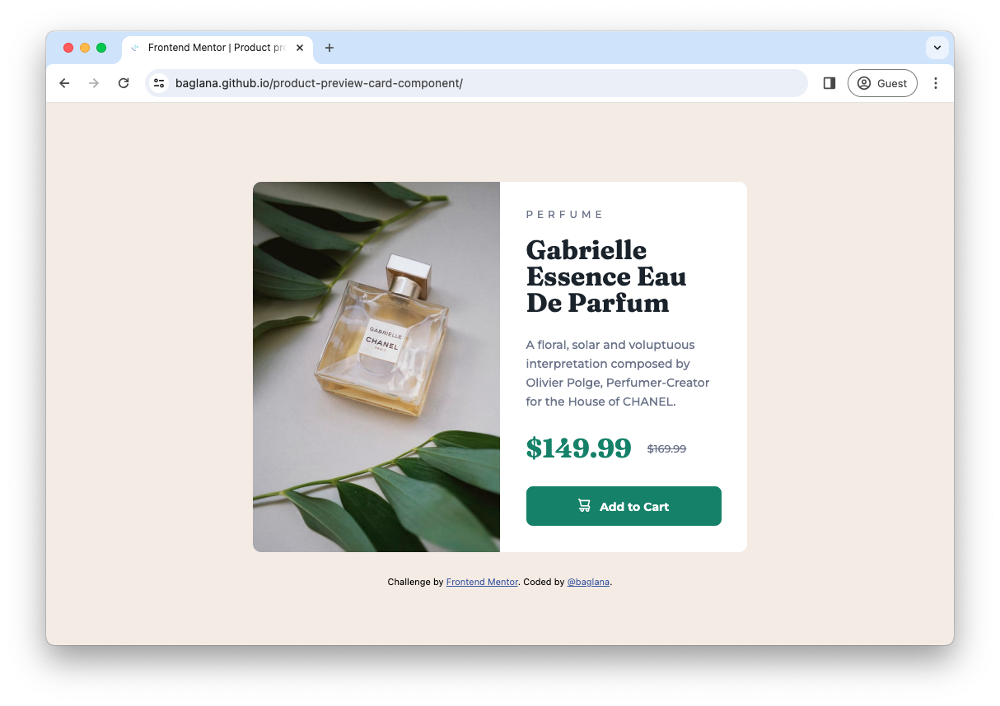
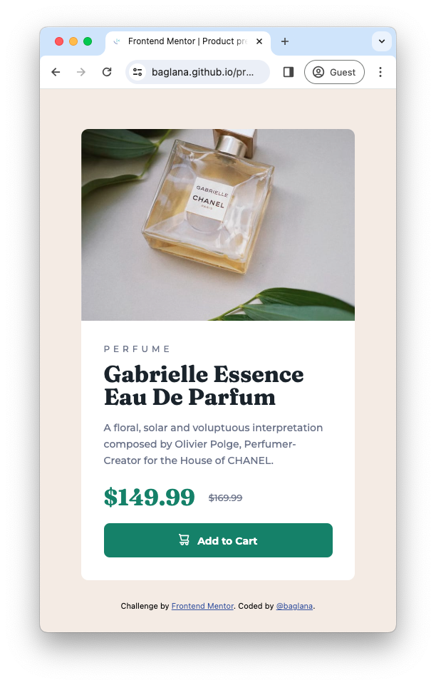

# Frontend Mentor - Product preview card component solution

This is a solution to the [Product preview card component challenge on Frontend Mentor](https://www.frontendmentor.io/challenges/product-preview-card-component-GO7UmttRfa). Frontend Mentor challenges help you improve your coding skills by building realistic projects. 

## Table of contents

- [Overview](#overview)
  - [The challenge](#the-challenge)
  - [Screenshots](#screenshots)
  - [Links](#links)
- [My process](#my-process)
  - [Built with](#built-with)
  - [What I learned](#what-i-learned)
  - [Continued development](#continued-development)

## Overview

### The challenge

Users should be able to:

- View the optimal layout depending on their device's screen size
- See hover and focus states for interactive elements

### Screenshots

#### Desktop


#### Mobile


#### GIF


### Links

- Solution URL: [https://github.com/baglana/product-preview-card-component](https://github.com/baglana/product-preview-card-component)
- Live Site URL: [https://baglana.github.io/product-preview-card-component/](https://baglana.github.io/product-preview-card-component/)

## My process

### Built with

- Semantic HTML5 markup
- CSS custom properties
- Flexbox
- Mobile-first workflow
- [Vite](https://vitejs.dev/) - Bundler

### What I learned

- Responsive Design using Media Queries

```css
.card__product-image {
    max-width: 100%;
    object-fit: cover;

    @media (min-width: 37.5rem) {
        height: 100%;
    }
}
```

- Responsive Images
```html
<picture>
  <source media="(min-width: 600px)" srcset="/image-product-desktop.jpg">
  
</picture>
```
- CSS variables
```css
:root {
  /* primary colors */
  --dark-cyan: hsl(158, 36%, 37%);
  --dark-cyan-hover: hsl(157, 43%, 18%);
  --cream: hsl(30, 38%, 92%);

  /* neutral colors */
  --very-dark-blue: hsl(212, 21%, 14%);
  --dark-grayish-blue: hsl(228, 12%, 48%);
  --white: hsl(0, 0%, 100%);
}
```

- Pseudo-classes & Pseudo-elements

```css
.card__add-to-cart-button:hover {
    background: var(--dark-cyan-hover, #1A4032);
    cursor: pointer;
}

.card__add-to-cart-button::before {
    content: url(/icon-cart.svg);
}
```

### Continued development

I would like to focus more on Grid layout in future projects.
